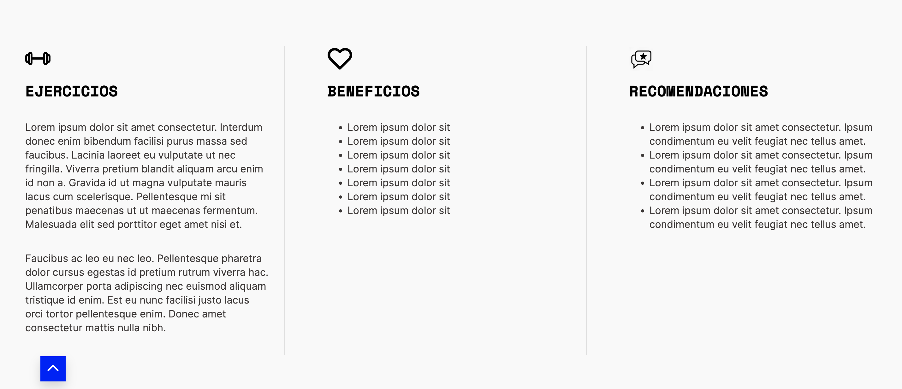

# E+B+R

<figure><figcaption></figcaption></figure>

Puedes editarlo de forma sencilla dentro de cada producto aquí:\

<figure><figcaption></figcaption></figure>

La intención es que puedas editar cada bloque predefinido de forma rápida, sin la necesiad de escribir de forma repetidas títulos como "Ejercicios", "Beneficios" y la imagen que lo acompaña pero si necesitas cambiar estos títulos puedes hacerlo en el apartado "Opciones del tema":\

<figure><figcaption></figcaption></figure>

Recuerda que los cambios efectuados en este apartado atañen a todos os productos. Si cambias el título "Ejercicios" éste cambia de forma transversal en todos los productos. Con la imagen ocurre exactamente lo mismo.
